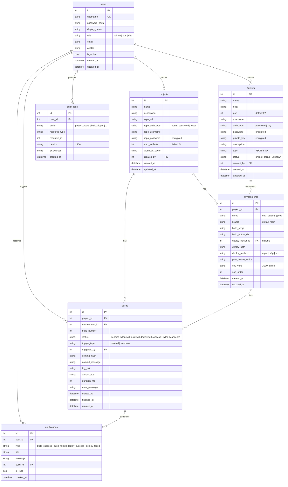
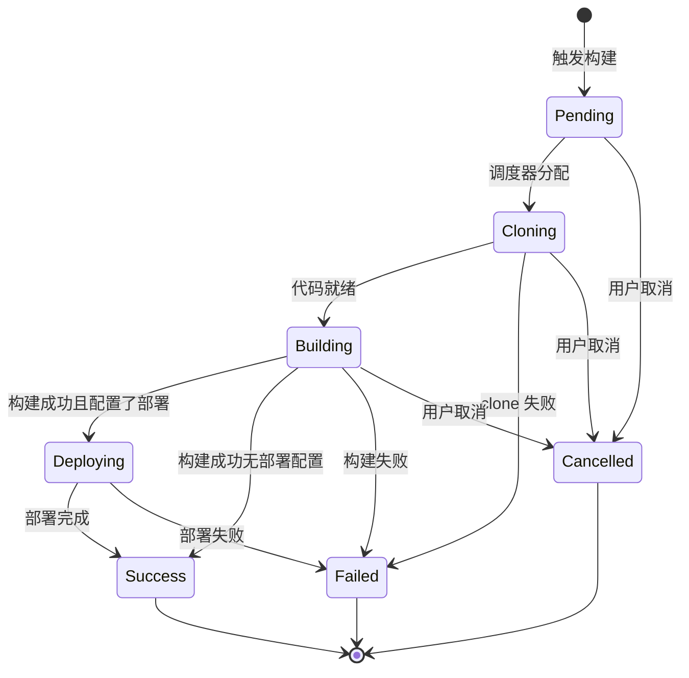

# BuildFlow - 代码构建交付平台系统设计

## 1. 技术栈与依赖版本

### Backend (Go)


| 依赖                    | 版本      | 用途        |
| --------------------- | ------- | --------- |
| Go                    | 1.25.7  | 语言运行时     |
| gin-gonic/gin         | v1.11.0 | HTTP 框架   |
| gorm.io/gorm          | v1.31.1 | ORM       |
| gorm.io/driver/sqlite | v1.6.0  | SQLite 驱动 |
| golang-jwt/jwt        | v5.3.1  | JWT 认证    |
| gorilla/websocket     | v1.5.3  | WebSocket |
| go-git/go-git         | v5.16.4 | Git 操作    |
| golang.org/x/crypto   | v0.48.0 | SSH 客户端   |
| spf13/viper           | v1.21.0 | 配置管理      |
| uber-go/zap           | v1.27.1 | 结构化日志     |


### Frontend (React)


| 依赖             | 版本     | 用途    |
| -------------- | ------ | ----- |
| React          | 19.2.1 | UI 框架 |
| Vite           | 7.3.x  | 构建工具  |
| Tailwind CSS   | 4.x    | 样式系统  |
| shadcn/ui      | latest | UI 组件 |
| React Router   | 7.13.x | 路由    |
| Zustand        | 5.0.x  | 状态管理  |
| TanStack Table | 8.21.x | 数据表格  |
| Recharts       | 3.7.x  | 图表    |
| Lucide React   | latest | 图标    |


---

## 2. 项目结构

```
dev-ops/
├── cmd/
│   └── server/
│       └── main.go                  # 入口，启动 HTTP 服务
├── internal/
│   ├── config/
│   │   └── config.go                # Viper 配置加载
│   ├── model/
│   │   ├── user.go
│   │   ├── project.go
│   │   ├── environment.go
│   │   ├── server.go
│   │   ├── build.go
│   │   ├── notification.go
│   │   └── audit_log.go
│   ├── repository/
│   │   ├── user_repo.go
│   │   ├── project_repo.go
│   │   ├── server_repo.go
│   │   ├── build_repo.go
│   │   ├── notification_repo.go
│   │   └── audit_repo.go
│   ├── service/
│   │   ├── auth_service.go          # JWT 签发/验证
│   │   ├── user_service.go
│   │   ├── project_service.go
│   │   ├── server_service.go
│   │   ├── build_service.go
│   │   ├── notification_service.go
│   │   └── audit_service.go
│   ├── handler/
│   │   ├── auth_handler.go
│   │   ├── user_handler.go
│   │   ├── project_handler.go
│   │   ├── server_handler.go
│   │   ├── build_handler.go
│   │   ├── webhook_handler.go
│   │   ├── notification_handler.go
│   │   ├── system_handler.go        # 备份/恢复/审计
│   │   └── ws_handler.go            # WebSocket
│   ├── engine/
│   │   ├── scheduler.go             # 构建调度器 (goroutine + semaphore)
│   │   ├── pipeline.go              # 构建流水线
│   │   ├── git.go                   # Git clone/pull/clean
│   │   └── logger.go                # 构建日志捕获
│   ├── deployer/
│   │   ├── deployer.go              # Deployer 接口
│   │   ├── rsync.go                 # rsync 实现
│   │   ├── sftp.go                  # SFTP 实现
│   │   └── scp.go                   # SCP 实现
│   ├── ws/
│   │   └── hub.go                   # WebSocket Hub (广播/订阅)
│   ├── middleware/
│   │   ├── auth.go                  # JWT 中间件
│   │   ├── rbac.go                  # 角色权限中间件
│   │   ├── audit.go                 # 审计日志中间件
│   │   └── cors.go
│   └── pkg/
│       ├── crypto.go                # 密码/凭证加密
│       ├── response.go              # 统一响应格式
│       └── validator.go             # 请求校验
├── web/                             # React 前端
│   ├── src/
│   │   ├── components/
│   │   │   ├── ui/                  # shadcn/ui 组件
│   │   │   ├── layout/
│   │   │   │   ├── app-layout.tsx   # 主布局 (侧边栏+顶栏)
│   │   │   │   ├── sidebar.tsx
│   │   │   │   └── header.tsx
│   │   │   ├── build-log-viewer.tsx # 实时日志终端组件
│   │   │   ├── notification-bell.tsx
│   │   │   └── ...
│   │   ├── pages/
│   │   │   ├── login.tsx
│   │   │   ├── dashboard.tsx
│   │   │   ├── projects/
│   │   │   │   ├── list.tsx
│   │   │   │   ├── detail.tsx
│   │   │   │   └── form.tsx
│   │   │   ├── servers/
│   │   │   │   ├── list.tsx
│   │   │   │   └── form.tsx
│   │   │   ├── builds/
│   │   │   │   └── detail.tsx
│   │   │   ├── users/
│   │   │   │   └── list.tsx
│   │   │   ├── audit-logs.tsx
│   │   │   └── settings.tsx
│   │   ├── stores/
│   │   │   ├── auth-store.ts
│   │   │   └── notification-store.ts
│   │   ├── hooks/
│   │   │   ├── use-websocket.ts
│   │   │   └── use-auth.ts
│   │   ├── lib/
│   │   │   ├── api.ts               # Fetch 封装
│   │   │   ├── utils.ts
│   │   │   └── constants.ts
│   │   ├── App.tsx
│   │   └── main.tsx
│   ├── index.html
│   ├── package.json
│   ├── tsconfig.json
│   └── vite.config.ts
├── config.yaml                      # 默认配置文件
├── Makefile                         # 构建命令
├── go.mod
└── go.sum
```

说明:

- 前端打包产物通过 Go 的 `embed.FS` 内嵌到二进制
- `cmd/server/main.go` 中使用 `gin.StaticFS` 提供前端静态文件
- 开发时前端独立 dev server (Vite)，通过代理连接后端

---

## 3. 数据库设计




### 关键约束

- `environments` 表对 `(project_id, name)` 建唯一索引
- `builds` 表对 `(project_id, build_number)` 建唯一索引
- 敏感字段 (password, private_key, repo_password) 使用 AES-256-GCM 加密存储
- SQLite 启用 WAL 模式 + busy_timeout=5000

---

## 4. API 设计

### 认证


| Method | Path                 | 说明       | 权限            |
| ------ | -------------------- | -------- | ------------- |
| POST   | /api/v1/auth/login   | 登录       | public        |
| POST   | /api/v1/auth/logout  | 登出       | authenticated |
| POST   | /api/v1/auth/refresh | 刷新 Token | authenticated |
| GET    | /api/v1/auth/me      | 当前用户信息   | authenticated |


### 用户管理


| Method | Path                 | 说明     | 权限            |
| ------ | -------------------- | ------ | ------------- |
| GET    | /api/v1/users        | 用户列表   | admin         |
| POST   | /api/v1/users        | 创建用户   | admin         |
| GET    | /api/v1/users/:id    | 用户详情   | admin         |
| PUT    | /api/v1/users/:id    | 更新用户   | admin         |
| DELETE | /api/v1/users/:id    | 删除用户   | admin         |
| PUT    | /api/v1/auth/profile | 更新个人资料 | authenticated |


### 项目管理


| Method | Path                        | 说明     | 权限              |
| ------ | --------------------------- | ------ | --------------- |
| GET    | /api/v1/projects            | 项目列表   | authenticated   |
| POST   | /api/v1/projects            | 创建项目   | authenticated   |
| GET    | /api/v1/projects/:id        | 项目详情   | authenticated   |
| PUT    | /api/v1/projects/:id        | 更新项目   | owner/ops/admin |
| DELETE | /api/v1/projects/:id        | 删除项目   | owner/ops/admin |
| POST   | /api/v1/projects/import     | 导入项目配置 | admin           |
| GET    | /api/v1/projects/:id/export | 导出项目配置 | admin           |


### 环境配置


| Method | Path                             | 说明   | 权限              |
| ------ | -------------------------------- | ---- | --------------- |
| GET    | /api/v1/projects/:id/envs        | 环境列表 | authenticated   |
| POST   | /api/v1/projects/:id/envs        | 创建环境 | owner/ops/admin |
| PUT    | /api/v1/projects/:id/envs/:envId | 更新环境 | owner/ops/admin |
| DELETE | /api/v1/projects/:id/envs/:envId | 删除环境 | owner/ops/admin |


### 构建


| Method | Path                        | 说明       | 权限            |
| ------ | --------------------------- | -------- | ------------- |
| GET    | /api/v1/projects/:id/builds | 构建历史     | authenticated |
| POST   | /api/v1/projects/:id/builds | 触发构建     | authenticated |
| GET    | /api/v1/builds/:id          | 构建详情     | authenticated |
| POST   | /api/v1/builds/:id/cancel   | 取消构建     | authenticated |
| POST   | /api/v1/builds/:id/deploy   | 手动部署/重部署 | authenticated |
| GET    | /api/v1/builds/:id/artifact | 下载构建物    | authenticated |
| POST   | /api/v1/builds/:id/rollback | 回滚到此版本   | ops/admin     |


### 服务器管理


| Method | Path                     | 说明    | 权限                     |
| ------ | ------------------------ | ----- | ---------------------- |
| GET    | /api/v1/servers          | 服务器列表 | authenticated (dev 只读) |
| POST   | /api/v1/servers          | 创建服务器 | ops/admin              |
| GET    | /api/v1/servers/:id      | 服务器详情 | ops/admin              |
| PUT    | /api/v1/servers/:id      | 更新服务器 | ops/admin              |
| DELETE | /api/v1/servers/:id      | 删除服务器 | ops/admin              |
| POST   | /api/v1/servers/:id/test | 测试连接  | ops/admin              |


### Webhook


| Method | Path                               | 说明       | 权限                 |
| ------ | ---------------------------------- | -------- | ------------------ |
| POST   | /api/v1/webhook/:projectId/:secret | Git 推送触发 | public (secret 验证) |


### 通知


| Method | Path                           | 说明   | 权限            |
| ------ | ------------------------------ | ---- | ------------- |
| GET    | /api/v1/notifications          | 通知列表 | authenticated |
| PUT    | /api/v1/notifications/:id/read | 标记已读 | authenticated |
| PUT    | /api/v1/notifications/read-all | 全部已读 | authenticated |


### 系统


| Method | Path                      | 说明   | 权限        |
| ------ | ------------------------- | ---- | --------- |
| GET    | /api/v1/system/audit-logs | 审计日志 | admin/ops |
| POST   | /api/v1/system/backup     | 导出备份 | admin     |
| POST   | /api/v1/system/restore    | 导入恢复 | admin     |


### WebSocket


| Path                | 说明      |
| ------------------- | ------- |
| /ws/builds/:id/logs | 实时构建日志流 |
| /ws/notifications   | 实时通知推送  |


### Dashboard


| Method | Path                            | 说明      | 权限            |
| ------ | ------------------------------- | ------- | ------------- |
| GET    | /api/v1/dashboard/stats         | 总览统计    | authenticated |
| GET    | /api/v1/dashboard/active-builds | 正在构建的任务 | authenticated |
| GET    | /api/v1/dashboard/recent-builds | 最近构建记录  | authenticated |


---

## 5. 构建引擎设计




### 调度器核心逻辑

```go
// scheduler.go 核心思路
type Scheduler struct {
    maxConcurrent int
    semaphore     chan struct{}  // 控制并发数
    builds        chan *BuildJob
    hub           *ws.Hub       // WebSocket 广播
}

func (s *Scheduler) Submit(job *BuildJob) {
    s.builds <- job  // 入队
}

func (s *Scheduler) Run() {
    for job := range s.builds {
        s.semaphore <- struct{}{}  // 获取令牌
        go func(j *BuildJob) {
            defer func() { <-s.semaphore }()  // 释放令牌
            s.execute(j)
        }(job)
    }
}
```

### 构建流水线步骤

```
1. [Cloning]  git clone/pull → git clean -fdx → git checkout <branch> → git reset --hard origin/<branch>
2. [Building] 注入环境变量 → exec 构建脚本 → 逐行捕获 stdout/stderr → 广播到 WebSocket
3. [Artifact] 打包 build_output_dir → 存储到 artifacts/ → 清理超出 max_artifacts 的旧产物
4. [Deploy]   选择 deployer (rsync/sftp/scp) → 推送到远程 → 执行 post_deploy_script
5. [Notify]   生成通知记录 → 广播到 WebSocket
```

### 文件存储布局

```
data/
├── db.sqlite                       # 数据库文件
├── workspaces/                     # Git 工作目录
│   └── project-{id}/
│       └── (git repo contents)     # 依赖缓存在此保留
├── artifacts/                      # 构建产物归档
│   └── project-{id}/
│       ├── build-001.tar.gz
│       ├── build-002.tar.gz
│       └── ...                     # 保留最近 N 个
└── logs/                           # 构建日志文件
    └── project-{id}/
        ├── build-001.log
        └── ...
```

---

## 6. 部署器接口设计

```go
// deployer.go
type Deployer interface {
    Deploy(ctx context.Context, opts DeployOptions) error
}

type DeployOptions struct {
    SourceDir    string      // 本地构建产物目录
    Server       ServerInfo  // 远程服务器信息
    RemotePath   string      // 远程目标路径
    Logger       BuildLogger // 日志回调
}

// 三种实现: RsyncDeployer, SFTPDeployer, SCPDeployer
// 根据 environment.deploy_method 字段工厂化创建
```

---

## 7. 前端页面与路由


| 路由                            | 页面                | 说明                   |
| ----------------------------- | ----------------- | -------------------- |
| /login                        | LoginPage         | 登录页                  |
| /                             | DashboardPage     | 仪表盘 (统计、活跃构建、最近构建)   |
| /projects                     | ProjectListPage   | 项目列表 (卡片/表格视图切换)     |
| /projects/new                 | ProjectFormPage   | 创建项目 (多步表单)          |
| /projects/:id                 | ProjectDetailPage | 项目详情 (环境 Tab + 构建历史) |
| /projects/:id/edit            | ProjectFormPage   | 编辑项目                 |
| /projects/:id/builds/:buildId | BuildDetailPage   | 构建详情 (实时日志终端)        |
| /servers                      | ServerListPage    | 服务器列表                |
| /servers/new                  | ServerFormPage    | 创建服务器                |
| /servers/:id/edit             | ServerFormPage    | 编辑服务器                |
| /users                        | UserListPage      | 用户管理 (admin)         |
| /audit-logs                   | AuditLogPage      | 审计日志 (admin/ops)     |
| /settings                     | SettingsPage      | 系统设置与备份 (admin)      |


### Dashboard 布局

```
┌──────────────────────────────────────────────────────────┐
│  [Logo]  BuildFlow          [通知铃铛]  [用户头像/菜单]     │
├─────────┬────────────────────────────────────────────────┤
│         │                                                │
│ 仪表盘   │  ┌──────┐ ┌──────┐ ┌──────┐ ┌──────┐          │
│ 项目     │  │总项目数│ │今日构建│ │成功率  │ │活跃构建│         │
│ 服务器   │  └──────┘ └──────┘ └──────┘ └──────┘          │
│ ──────  │                                                │
│ 用户管理  │  ┌─ 正在构建 ──────────────────────────────┐   │
│ 审计日志  │  │ project-a / prod  ██████████░░ 67%      │   │
│ 系统设置  │  │ project-b / dev   ████░░░░░░░░ 30%      │   │
│         │  └──────────────────────────────────────────┘   │
│         │                                                │
│         │  ┌─ 最近 7 天构建趋势 ─────────────────────┐    │
│         │  │  (Recharts 折线图: 成功/失败/总数)        │    │
│         │  └──────────────────────────────────────────┘   │
│         │                                                │
│         │  ┌─ 最近构建 ──────────────────────────────┐    │
│         │  │ (TanStack Table: 项目/环境/状态/时间/触发) │    │
│         │  └──────────────────────────────────────────┘   │
└─────────┴────────────────────────────────────────────────┘
```

---

## 8. 认证与权限

### JWT 结构

```json
{
  "sub": 1,
  "username": "admin",
  "role": "admin",
  "exp": 1740000000
}
```

- Access Token: 有效期 2 小时
- Refresh Token: 有效期 7 天，存 HttpOnly Cookie
- 前端在 Zustand auth store 中管理 Token 状态

### RBAC 中间件

```go
// 路由注册示例
api := r.Group("/api/v1", middleware.Auth())
{
    // admin only
    api.GET("/users", middleware.RequireRole("admin"), handler.ListUsers)

    // ops + admin
    api.POST("/servers", middleware.RequireRole("ops", "admin"), handler.CreateServer)

    // all authenticated
    api.GET("/projects", handler.ListProjects)

    // owner or ops/admin
    api.PUT("/projects/:id", middleware.RequireOwnerOrRole("ops", "admin"), handler.UpdateProject)
}
```

---

## 9. 备份与导入导出

### 系统备份 (admin)

- 导出: 将 SQLite 数据库文件 + config.yaml 打包为 `.tar.gz`
- 恢复: 上传 `.tar.gz`，解压覆盖（需确认操作）

### 项目导入导出

- 导出: 项目配置 + 环境配置 + 环境变量 序列化为 JSON
- 导入: 解析 JSON 创建项目（密码/Token 字段不导出，需重新填写）

---

## 10. 开发与构建流程

```bash
# 开发模式
make dev-backend   # 启动 Go 后端 (air 热重载)
make dev-frontend  # 启动 Vite dev server (代理到后端)

# 生产构建
make build         # 1. 构建前端 → 2. embed 到 Go → 3. 编译单二进制

# 产物
./buildflow --config config.yaml   # 单文件启动
```

### config.yaml 示例

```yaml
server:
  port: 8080
  host: "0.0.0.0"

database:
  path: "./data/db.sqlite"

jwt:
  secret: "change-me-in-production"
  access_ttl: "2h"
  refresh_ttl: "168h"

build:
  max_concurrent: 3
  workspace_dir: "./data/workspaces"
  artifact_dir: "./data/artifacts"
  log_dir: "./data/logs"

encryption:
  key: "32-byte-hex-key-for-aes-256"
```

