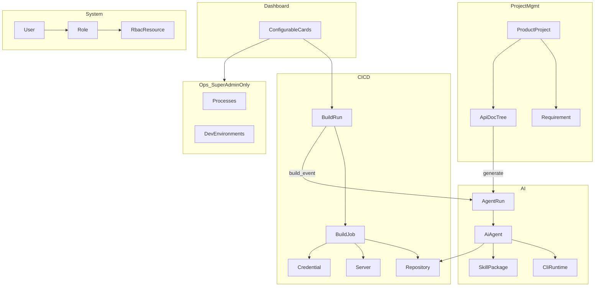

# 磐石（Bedrock）2.0 产品需求文档（PRD）

| 项       | 内容                                                         |
| -------- | ------------------------------------------------------------ |
| 文档版本 | 2.0.0-draft                                                  |
| 状态     | 已确认产品决策基线，待评审落地                               |
| 来源     | 产品确认决策、现有代码能力基线；**本文为 2.0 唯一需求真源**  |
| 范围     | 产品需求、权限、流程、状态、概念数据模型、API 草案、验收标准 |

---

## 1. 产品愿景与定位

### 1.1 愿景

磐石（Bedrock）将成为真正的**项目开发基石**：在同一平台上覆盖宿主机运维、CI/CD 交付、产品协作（需求与接口文档）以及 AI 智能体与开放 Agent Skills 资产，帮助团队从「写代码—构建—部署—协作—智能化」形成闭环。

### 1.2 产品定位

| 域       | 定位                                                                    |
| -------- | ----------------------------------------------------------------------- |
| 仪表盘   | 可配置、受权限约束的总览入口                                            |
| 运维     | 宿主机级能力，仅内置超级管理员可用                                      |
| 资源管理 | 共享资源域：代码仓库、服务器、凭证                                              |
| CI/CD    | 独立交付域：任务、执行、部署（引用资源管理中的仓库/服务器/凭证）                |
| 项目管理 | 独立协作域：产品项目、需求、接口文档；与 CI/CD **解耦**，需要时手动关联 |
| AI       | CLI 运行时、智能体编排、Skills 资产库                                   |
| 系统管理 | 用户、角色、权限资源、字典、操作日志                                    |

### 1.3 设计原则

1. **域独立，松耦合关联**：项目管理与 CI/CD 各自一等公民，不强制绑定。
2. **配置驱动扩展**：数据库驱动、安装源、开发环境、CLI 等通过配置扩展，默认零依赖。
3. **权限即可见性**：菜单、页面、API、仪表盘卡片均受 RBAC 资源控制；侧栏由登录下发的两层分组菜单驱动（`u-group-nav`）；菜单项支持自定义图标。
4. **命名消歧**：避免「Agent / Environment / Project / Proxy / Resource」多义混用。
5. **沿用成熟交付语义**：构建成功可下载制品；分发失败不推翻构建成功状态。

### 1.4 目标

- 将现有「CI/CD 控制台」演进为「开发基石平台」。
- 提供可配置 RBAC，替代固定三角色字符串模型。
- 引入独立智能体运行域与开放 Agent Skills 资产管理。
- 引入独立产品项目、需求与 Markdown 接口文档树。
- 强化宿主机运维：进程管理 + 开发环境管理（含每环境安装源）。

---

## 2. 术语表

| 术语                            | 定义                                                                                                       | 禁止混用为                            |
| ------------------------------- | ---------------------------------------------------------------------------------------------------------- | ------------------------------------- |
| **产品项目（Product Project）** | 项目管理域的协作聚合根：成员、需求、接口文档                                                               | CI/CD 仓库或构建任务                  |
| **代码仓库（Repository）**      | CI/CD 中的 Git 源码地址与认证配置                                                                          | 产品项目                              |
| **构建任务（Build Job）**       | 仓库下的可重复执行配置（脚本、分支策略、部署目标等）                                                       | 单次执行记录                          |
| **构建执行（Build Run）**       | 某次构建任务的运行实例与日志/制品                                                                          | 构建任务配置                          |
| **部署目标（Deploy Target）**   | 构建任务绑定的分发配置（服务器/路径/方法）                                                                 | 服务器实体本身                        |
| **服务器（Server）**            | SSH 或部署 Agent 可达的部署主机                                                                            | Bedrock 服务进程                      |
| **部署 Agent（Deploy Agent）**  | 目标机上独立二进制，用于 HTTP 上传与远程执行                                                               | AI 智能体                             |
| **凭证（Credential）**          | 通用密钥库条目（Git/SSH/Token/API Key 等），受 RBAC 控制                                                   | 仅 Git 仓库密码                       |
| **开发环境（DevEnvironment）**   | 宿主机上的 Go/Node/Java/Python 等运行时与包管理器                                                          | CI「环境」                            |
| **AI CLI / CLI 运行时**         | Claude Code、OpenCode、Reasonix、Codex 等 AI 命令行工具                                                    | 网络代理                              |
| **AI 智能体（AI Agent）**       | 平台托管的智能体定义：提示词、CLI、Skill、触发器、上下文                                                   | 部署 Agent                            |
| **智能体运行（Agent Run）**     | 一次智能体异步执行及交互记录；记录状态、日志与文本输出，不承载文件制品                                     | 构建执行                              |
| **开放 Agent Skill**            | 符合 [Agent Skills](https://agentskills.io/specification) 规范的技能包（含 `SKILL.md`）                    | Cursor 私有专有格式（可兼容但不限定） |
| **菜单分组（MenuGroup）**       | 侧栏分组（如系统管理、CI/CD）；含 `code`、`route_prefix`；**不参与**权限勾选                                 | 可授权功能                            |
| **权限资源（RBAC Resource）**   | 可授权对象：菜单（`type=menu`）或功能（`action`/`card`）；鉴权只认功能 `full_code`                          | CPU/磁盘等系统资源                    |
| **菜单资源**                    | `type=menu` 的权限资源，对应侧栏叶子项；归属某 MenuGroup；可 `hidden`（仅挂功能、不进导航）                 | 分组 / 普通 API 功能                  |
| **系统资源指标**                | CPU、内存、磁盘、进程占用等宿主机指标                                                                      | 权限资源                              |
| **超级管理员（Super Admin）**   | `users.is_super_admin` 为鉴权真源；内置角色 `super_admin`（`type=builtin`）与唯一超管用户 1:1 同步           | 普通自定义角色                        |
| **个人访问令牌（PAT）**         | 用户生成的 API 令牌，用于 Skill 安装器等外部对接                                                           | JWT 会话令牌                          |

---

## 3. 部署形态与运行约束

### 3.1 部署形态（沿用当前项目）

```text
┌─────────────────────────────────────────────┐
│  Bedrock Server（单体二进制）                 │
│  - Go 后端 API / WS / 调度器 / Cron           │
│  - 前端产物 embed 进同一二进制                 │
│  - 本机构建执行、本机 AI CLI 执行              │
│  - 本地工作区 / 制品 / 日志 / 缓存目录         │
└──────────────────────┬──────────────────────┘
                       │ rsync / sftp / scp / agent / local
                       ▼
┌─────────────────────────────────────────────┐
│  目标服务器 + 可选 Deploy Agent（独立二进制） │
└─────────────────────────────────────────────┘
```

**约束：**

1. 生产发布物为**单服务端二进制 + 嵌入前端静态资源**。
2. **Deploy Agent** 作为独立二进制发布与升级，不与 Server 合并。
3. 构建任务与智能体首期均在 **Bedrock 所在宿主机**执行。
4. 切换数据库驱动**不要求**重新构建前后端产物，修改配置并重启即可。

### 3.2 数据库配置需求

数据库类型通过配置文件（及环境变量覆盖）选择。

| 项         | 要求                                                                          |
| ---------- | ----------------------------------------------------------------------------- |
| 支持驱动   | `sqlite`（默认）、`postgres` / `postgresql`、`mysql`                          |
| 默认场景   | SQLite，零外部依赖，适合单机与轻量部署                                        |
| 切换方式   | 修改配置 → 重启服务；无需重编                                                 |
| 启动行为   | 启动时连通性检查失败则**拒绝启动**并输出明确错误                              |
| 业务一致性 | 三种驱动在字段语义、唯一约束、事务边界、排序与分页行为上保持一致              |
| Schema     | 启动时自动对齐 schema（具体实现方式由技术方案决定，但对业务侧表现为自动可用） |

**配置项（概念级）：**

```yaml
database:
  driver: sqlite # sqlite | postgres | mysql
  # SQLite
  path: ./data/db.sqlite
  # 通用连接（postgres/mysql）
  host: 127.0.0.1
  port: 5432 # mysql 默认 3306
  name: bedrock
  user: bedrock
  password: "***"
  ssl_mode: disable # 按驱动语义解释
  # 连接池
  max_open_conns: 25
  max_idle_conns: 5
  conn_max_lifetime: 1h
```

**验收要点：**

- 默认 `driver=sqlite` 可在无外部数据库时完成安装与全部核心流程。
- 切换到 PostgreSQL / MySQL 后，用户、仓库、构建、智能体等核心 CRUD 与约束行为一致。
- 错误配置（错误密码、不可达主机）启动失败信息可读。

---

## 4. 用户、角色与权限

### 4.1 身份模型

| 概念           | 说明                                                                                                                                 |
| -------------- | ------------------------------------------------------------------------------------------------------------------------------------ |
| 用户           | 登录主体；可禁用；绑定多个自定义角色；权限 = 各角色功能 `full_code` 并集                                                           |
| 超级管理员     | 鉴权真源为 `users.is_super_admin`；内置角色 `code=super_admin`（`type=builtin`）与唯一超管用户 1:1 同步；不可删、不可改权限、不可通过用户绑角 API 赋给他人 |
| 自定义角色     | `type=custom`；可创建/编辑/删除；绑定功能 `full_code` 集合（不可写入 `super_admin_only` 功能）                                      |
| 项目成员角色   | 产品项目内：负责人、项目管理员、成员、只读（见 §8）                                                                                |

### 4.2 权限资源模型

#### 4.2.1 编码格式（`full_code`）

鉴权只认功能的 **`full_code`**：

```text
{menu_code}:{feature_code}
```

| 段             | 说明                                                                 |
| -------------- | -------------------------------------------------------------------- |
| `menu_code`    | 菜单 `code`，全局唯一，**不含 `.`**（域名段用 `_`，如 `system_users`） |
| `feature_code` | 同菜单下唯一的功能码（`view` / `create` / … 或卡片码）               |
| `:`            | 整串仅出现一次；菜单自身 `full_code = code`（无冒号）                |

**约定：**

1. 菜单 `code` 不含 `.`；旧 path 中的 `.` 已改为 `_`（如 `system.users:view` → `system_users:view`）。
2. 进入某菜单/页面至少需要 `{menu_code}:view`；按钮与 API 校验更细功能码。
3. 角色绑权只存功能 `full_code`；角色授权 UI 为三层：分组（只读标题）→ 菜单 → 功能。
4. 常用 feature：`view`、`create`、`update`、`delete`、`execute`、`download`、`use`、`view_all`、`manage_all` 等。

**示例：**

| 权限码（`full_code`）          | 含义                           |
| ------------------------------ | ------------------------------ |
| `dashboard:view`               | 查看/进入仪表盘                |
| `dashboard:system_info`   | 查看系统信息卡片 |
| `dashboard:system_status` | 查看系统状态卡片 |
| `resource_repositories:view`   | 查看代码仓库页                 |
| `resource_repositories:create` | 创建代码仓库                   |
| `cicd_build_runs:view`         | 查看构建执行 / 构建摘要卡片    |
| `resource_credentials:view`    | 查看凭证元数据                 |
| `resource_credentials:use`     | 在任务中引用/使用凭证          |
| `ops_processes:view`           | 查看进程（`super_admin_only`） |
| `ops_processes:execute`        | 终止进程等执行类操作           |
| `ops_dev_environments:execute` | 执行安装/升级/卸载/切版本      |
| `project_projects:view`        | 查看产品项目                   |
| `project_projects:view_all`    | 查看全部项目（无需加入）       |
| `project_projects:manage_all`  | 管理全部项目（无需加入）       |
| `project_requirements:create`  | 创建需求                       |
| `project_docs:execute`         | 触发智能体生成文档             |
| `ai_agents:execute`            | 手动触发智能体                 |
| `ai_skills:download`           | 下载 Skill 包                  |
| `system_roles:update`          | 编辑角色权限                   |
| `system_resources:view`        | 查看权限资源 / 菜单分组        |
| `system_resources:update`      | 维护权限资源（含菜单图标）     |

#### 4.2.2 菜单分组与菜单资源（左侧导航）

侧栏组织为：**MenuGroup（分组）→ 菜单项**。分组不参与权限勾选；菜单与功能是一等权限资源。

| 字段（概念）       | 说明                                                                 |
| ------------------ | -------------------------------------------------------------------- |
| MenuGroup.code     | 分组码，全局唯一、不含 `.`；另有 `name`、`route_prefix`、`sort_key` |
| menu.code / full_code | 菜单码；菜单 `full_code = code`                                   |
| group_id           | 菜单必填，归属分组                                                   |
| type               | `menu` \| `action` \| `card`                                         |
| title / route      | 显示名；叶子菜单前端路由（可空；隐藏挂载菜单通常无 route）           |
| hidden             | 仅菜单：为 true 时永不进入用户导航（用于仅挂功能的卡片挂载菜单等） |
| super_admin_only   | 菜单/功能：非超管不可见、不可绑权、API 拒绝                          |
| icon               | 菜单图标 Base64；**原始体积 ≤ 32KB**                                 |
| enabled / sort_key | 启用与排序                                                           |

**规则：**

1. 菜单图标以 Base64 内嵌随菜单数据存储与下发，不走独立静态 URL；超限 400。
2. 登录 / `GET /auth/me` 返回**两层**菜单：`{ title, children: { title, path, icon? }[] }[]`，对齐侧栏 `u-group-nav`。
3. 过滤：`hidden=false`、enabled、非超管去掉 `super_admin_only`、需具备 `{menuCode}:view`；空分组不返回。
4. 前端侧栏**只渲染**接口返回的分组菜单，不本地硬编码全量后再隐藏。
5. 路由直达仍由服务端 403 兜底。

#### 4.2.3 通用规则

- 无对应功能权限 → 菜单不下发、路由不可进入、API 返回 403、仪表盘相关卡片不可配置且不可显示。
- `super_admin_only`（种子中运维域默认 true）：服务端拒绝写入角色权限；生效时非超管一律拒绝（不再硬编码 `ops` 前缀）。
- 产品项目内权限与全局 RBAC **同时生效**：见 DESIGN §4.4（`view_all` / `manage_all` + 项目成员角色）。

### 4.3 全局权限矩阵（首期基线）

| 能力                                 | 超级管理员 | 具备对应资源的自定义角色 | 无权限用户             |
| ------------------------------------ | ---------- | ------------------------ | ---------------------- |
| 运维（进程/开发环境）                | ✓          | ✗（强制）                | ✗                      |
| 系统管理（用户/角色/资源/字典/日志） | ✓          | 按资源                   | ✗                      |
| 资源管理（仓库/服务器/凭证）         | ✓          | 按资源                   | ✗                      |
| CI/CD                                | ✓          | 按资源                   | ✗                      |
| 项目管理                             | ✓          | 按资源 + 项目成员        | ✗                      |
| AI / Skills                          | ✓          | 按资源                   | ✗                      |
| 仪表盘卡片                           | ✓          | 仅可见有资源权限的卡片   | 仅公共只读卡片（若有） |

### 4.4 认证

- Web：JWT `access_token` + `refresh_token`（可沿用现有时效语义，如 access 较短、refresh 较长；refresh 默认 7 天）。
- **Token 存储（前端）：** 因本系统**可能部署在非 HTTPS 环境**（内网 HTTP、IP 直访等），`access_token` 存 **Web Storage** 并以 `Authorization: Bearer` 传递；`refresh_token` 仅由服务端通过 **`Set-Cookie`** 下发（HttpOnly，**不设 Secure**）。前端不读写 refresh_token。
- 登录：支持加密传输密码（沿用 `password_cipher` 思路）。
- Skill 安装器：用户 **个人访问令牌（PAT）**。
- 智能体外部触发 API：用户 JWT 或 PAT（至少一种；若同时支持，PAT 需可限定 scope）。
- Webhook 触发构建：公开路径 + 仓库/任务级 secret（沿用现有公开 webhook 思路）。
- 刷新：access 过期（HTTP 401）时调用 `/auth/refresh`（自动携带 Cookie）换发 `access_token` 并重试原请求；refresh 失效则清理会话并跳转登录页。

---

## 5. 信息架构

### 5.1 左侧菜单（分组 + 菜单资源驱动）

左侧导航来源于 **MenuGroup + 菜单资源**，登录后按下发的两层结构渲染（`u-group-nav`），不是前端静态写死后再按角色隐藏。

**预置分组与菜单（示例）：**

| 分组 code  | 标题示例 | 典型菜单 code                                                                                                      |
| ---------- | -------- | ------------------------------------------------------------------------------------------------------------------ |
| `overview` | 工作台   | `dashboard`（卡片：`build_summary` / `agent_run_summary` / `system_info` / `system_status`）                               |
| `ops`      | 运维     | `ops_processes`、`ops_dev_environments`（均 `super_admin_only`）                                                   |
| `resource` | 资源管理 | `resource_repositories`、`resource_servers`、`resource_credentials`、`resource_clis`、`resource_tokens`            |
| `cicd`     | CI/CD    | `cicd_build_jobs`、`cicd_build_runs`                                                                               |
| `project`  | 项目管理 | `project_projects`、`project_requirements`、`project_docs`                                                          |
| `ai`       | AI       | `ai_agents`、`ai_runs`、`ai_skills`                                                                                |
| `system`   | 系统管理 | `system_users`、`system_roles`、`system_resources`、`system_dictionaries`、`system_operation_logs`                  |

进入页所需权限：叶子菜单对应 `{menu_code}:view`；分组仅在有可见子菜单时出现。

### 5.2 登录后菜单下发

1. `POST /auth/login` 与 `GET /auth/me` 的响应中包含：用户信息、功能 `full_code` 列表、**两层菜单**（分组 → 菜单项）。
2. 菜单项至少含：`title`、`path`（前端路由）、可选 `icon`（Base64）。
3. 更换角色权限或菜单配置后，用户再次拉取 `/auth/me`（或重新登录）即看到新菜单。
4. 因图标随菜单 JSON 下发，须严格执行单图标 ≤ 32KB，控制整体菜单载荷。

### 5.3 全局交互规范

1. 列表页：筛选、分页、排序；危险操作二次确认。
2. 敏感字段：密文不回显；编辑时留空表示不修改。
3. 长任务：构建执行、智能体运行、开发环境安装均异步；提供状态、日志、取消（如适用）。
4. 审计：写操作写入操作日志。
5. 通知：构建/智能体终态可推送站内通知（可复用现有通知通道）。

---

## 6. 仪表盘

### 6.1 目标

提供可配置总览：用户可添加、移除、排序卡片；卡片与权限资源绑定。

### 6.2 内置卡片

| 卡片         | 内容                                                      | 绑定权限（示例）                 |
| ------------ | --------------------------------------------------------- | -------------------------------- |
| 构建任务卡片 | 运行中/排队数量、最近执行结果、成功率摘要、跳转到执行详情 | `cicd_build_runs:view`           |
| 系统信息卡片 | 产品版本、OS、架构、Go/运行时信息、启动时间、主机名等     | `dashboard:system_info`     |
| 系统状态卡片 | CPU/内存/磁盘占用、服务健康（API 存活）、关键目录可用空间 | `dashboard:system_status`   |

> 说明：进入仪表盘需 `dashboard:view`；卡片另受上表 `full_code` 约束。系统信息/状态对非超管可只读展示；进程明细与危险操作仍仅在运维模块（`super_admin_only`）。

### 6.3 卡片配置

- 用户可自定义：显示/隐藏、排序。
- 无资源权限的卡片：不可配置、不可显示（即使历史配置中存在，加载时过滤）。
- 默认布局：对有权限用户预置上述三类卡片。

### 6.4 验收标准

1. 无 `cicd_build_runs:view` 的角色看不到构建任务卡片且无法添加。
2. 用户调整顺序后刷新仍保持。
3. 系统状态卡片指标在合理频率刷新，不阻塞页面。

---

## 7. 运维（仅超级管理员）

### 7.1 准入

- 运维菜单与功能标记 `super_admin_only`；仅超级管理员可见菜单、可调用 API。
- 系统支持多用户，但运维域与业务 RBAC 正交：**非超管永远不可进入**（即使自定义角色误绑权，服务端拒绝写入与生效）。

### 7.2 进程管理

**能力：**

- 列表：PID、名称、CPU、内存、用户、启动时间、监听端口（如可获取）。
- 筛选：关键字、PID、端口。
- 排序：CPU / 内存 / 名称。
- 终止：向指定 PID 发送终止信号。
- 保护：禁止终止 Bedrock Server 自身关键进程；禁止明显危险的系统关键进程（实现层黑名单）。

**验收：**

1. 超管可查询并终止普通用户进程（在权限允许的 OS 范围内）。
2. 尝试终止自身服务进程被拒绝。
3. 非超管调用 API 返回 403。

### 7.3 开发环境管理

**目标：** 管理 Bedrock 宿主机上的开发环境（语言运行时），而非 CI 构建配置。

**内置开发环境（首期）：**

| 工具族  | 示例组件                                                        |
| ------- | --------------------------------------------------------------- |
| Go      | go toolchain                                                    |
| Node.js | node + npm / bun / pnpm（可检测已安装包管理器）                 |
| Java    | JDK + Maven / Gradle（可检测）                                  |
| Python  | python + pip / uv（可检测）                                     |
| 自定义  | 管理员定义 name、检测脚本、安装/升级/卸载命令行脚本、版本列表脚本 |

**操作：**

1. 检测：是否安装、当前默认版本、可执行路径、健康状态。
2. 安装 / 升级 / 卸载。
3. 多版本并存时切换默认版本（如适用）。
4. 安装源管理（见下）。

**安装源：**

- 每种工具可配置**多个有优先级的源**（官方、国内镜像、自定义 URL）。
- 安装时按优先级尝试；失败自动下一源；记录失败原因。
- 支持源连通性检测。
- 自定义环境可使用命令行脚本变量（版本、可执行文件、源 URL 等）。

**验收：**

1. 未安装工具可按源优先级完成安装并检测通过。
2. 第一源失败、第二源成功时任务成功且日志可见失败回退。
3. 自定义开发环境定义可被检测与安装流程复用。
4. 非超管不可访问。

---

## 8. 项目管理

> 与 CI/CD **完全独立**。可手动建立关联（例如需求关联某仓库、接口文档生成时选择仓库），但不强制。

### 8.1 产品项目

**字段（核心）：** 名称、标识（唯一 slug）、描述、状态（活跃/归档）、负责人、标签、创建时间。

**成员与项目角色：**

| 项目角色        | 能力                                                   |
| --------------- | ------------------------------------------------------ |
| 负责人（Owner） | 全部项目内管理权；可转让；可解散/归档（另受全局 RBAC） |
| 项目管理员      | 管理成员（除转让负责人）、需求与文档管理               |
| 成员            | 创建/编辑需求与文档（按细则）、评论                    |
| 只读            | 查看项目内内容                                         |

**规则：**

- 创建项目者默认为负责人。
- 列表可见性：无 `project_projects:view_all` 时仅见自己加入的项目；持有 `view_all` 可见全部。`manage_all` 可管理全部项目成员与内容且无需加入。普通 `project_projects:update` **不**隐含全局越权（与 DESIGN §4.4 一致）。

### 8.2 需求管理（结构化列表）

**字段：** 标题、描述、状态、优先级、负责人、标签、附件、评论、创建/更新时间。

**状态建议：** `backlog` / `todo` / `doing` / `done` / `cancelled`（可用数据字典扩展）。

**能力：** 列表筛选分页、创建编辑删除、状态流转、评论、附件上传下载。

### 8.3 接口文档（Markdown 目录树）

**形态：**

- 嵌套目录 + 文档节点。
- 文档内容为 Markdown 文件。
- 支持上传文件/压缩包导入到目录树、重命名、移动排序、删除。
- 支持选择智能体，基于上下文（固定提示词 + 选定代码仓库）**生成或更新**接口文档，结果写回目录树。

**验收：**

1. 可构建多级目录并上传 `.md`。
2. 智能体生成任务可追踪，成功后文档出现在指定目录。

---

## 9. CI/CD

### 9.1 代码仓库

**独立实体字段：** 名称、Git URL、默认分支、认证方式（无/凭证）、关联凭证、Webhook Secret、Webhook 类型/JSONPath（可沿用现有多平台解析能力）、描述、标签、创建者。

**能力：** CRUD、测试拉取/列分支、Webhook URL 展示与轮换 secret、被构建任务引用后删除保护。

### 9.2 构建任务（Build Job）

**模型：** 一个仓库下可配置多个构建任务；每个任务产生多次构建执行。

**任务配置（核心）：**

| 分组 | 字段                                                              |
| ---- | ----------------------------------------------------------------- |
| 基础 | 名称、描述、启用状态、所属仓库                                    |
| 源码 | 分支策略（固定分支/参数覆盖）、浅克隆等                           |
| 构建 | 脚本类型、构建脚本、工作目录、输出目录、缓存路径、环境变量/变量组 |
| 触发 | 手动、Cron、Webhook（匹配分支规则）                               |
| 部署 | 多个部署目标（服务器、远程路径、方法、部署后脚本、顺序）          |
| AI   | 可选：构建事件触发的智能体绑定（见 §10）                          |
| 保留 | 最大制品数、制品格式（gzip/zip）                                  |

**执行位置：** 仅 Bedrock 宿主机。

### 9.3 构建执行（Build Run）

**触发类型：** `manual` / `webhook` / `cron` / `retry` / `redistribute`。

**阶段建议：** `pending` → `cloning` → `building` → `archiving` →（可选 `agent`）→ `distributing` → 终态。

**状态规则（继承并固化）：**

1. 构建与归档成功后，执行状态为 `success`，制品可下载。
2. **分发/部署失败不将构建执行改为 `failed`**；通过 `distribution_summary` 与各部署目标执行行表达。
3. 构建阶段失败 → `failed`；用户取消 → `cancelled`（若已 success 仅取消分发，则保持 success + summary=cancelled）。
4. 支持取消、重试（新执行记录）、重新分发（基于已有制品）。

**并发：** 全局最大并发可配置；超出排队。

BuildRun 的输出目录、制品归档、保留与下载能力属于 CI/CD 域，不因 Agent 工作区或 AgentRun 不提供文件制品而改变。

### 9.4 服务器

沿用现有能力：主机、端口、OS、认证方式（password/key/ssh-agent/deploy-agent）、连接测试、被部署目标引用保护。

### 9.5 凭证

**通用凭证库：**

| 类型（示例） | 用途                              |
| ------------ | --------------------------------- |
| `password`   | 用户名密码（Git/SSH 等）          |
| `token`      | Personal Access Token / API Token |
| `ssh_key`    | 私钥（及可选 passphrase）         |
| `api_key`    | 通用 API Key                      |

**共享与权限：** 通过 RBAC 控制查看/使用/管理；不再仅限「创建者私有」单一模型（可保留 `owner` 字段用于审计，但授权以角色资源为准）。敏感值加密存储。

### 9.6 部署方法

继续支持：`rsync` / `sftp` / `scp` / `agent` / `local`。

### 9.7 验收标准

1. 同一仓库可创建 ≥2 个构建任务并分别执行。
2. Webhook 按分支匹配触发对应任务。
3. 部署失败时制品仍可下载，执行状态为 success，分发汇总为 partial/all_failed。
4. 无凭证权限用户无法读取密文或盗用他人凭证执行拉取。

---

## 10. AI

### 10.1 CLI 管理

**内置 CLI（首期）：** Claude Code、OpenCode、Reasonix、Codex CLI。

**能力：**

- 目录列表：名称、key、二进制、版本、安装状态、路径、健康。
- 安装 / 升级 / 卸载。
- 全局配置（如 API Base、环境变量模板、默认参数）——不强制覆盖 CLI 自身登录态文件，但平台可管理「运行时注入配置」。
- **安装源**：多源优先级、连通性检测、失败回退（与开发环境同源策略）。

### 10.2 智能体定义

| 字段          | 说明                       |
| ------------- | -------------------------- |
| name          | 名称                       |
| description   | 描述                       |
| enabled       | 是否启用                   |
| cli_key       | 使用的 AI CLI              |
| system_prompt | 固定系统提示词             |
| skill_ids     | 显式绑定的一个或多个 Skill |
| build_job_ids | 可选绑定构建任务工作区     |
| output_dir    | 固定产出目录相对名（默认 `output`） |
| timeout       | 超时                       |
| created_by    | 创建者                     |

每个 Agent 唯一对应 `{workspace}/agents/agent-{id}/` 持久根工作区。所有 Run 直接复用该目录，启动后续 Run 时不得清空根目录已有文件，也不为单次 Run 创建独立输出目录。每个 Agent 另有固定产出目录 `{agentRoot}/{output_dir}`（默认相对名 `output`），跨 Run 复用；CLI 同时接收 `BEDROCK_AGENT_WORKDIR` 与 `BEDROCK_AGENT_OUTPUT`。

### 10.3 智能体上下文（首期）

仅两类：

1. **静态提示词**（定义中的 system_prompt + 触发时附加输入）。
2. **代码仓库**：同步到 Agent 持久根工作区或通过绑定目录提供，供 CLI 操作。

> 首期不注入需求、接口文档、历史会话作为自动上下文（接口文档生成场景由触发时显式选择仓库与目标路径）。

### 10.4 触发器（首期）

| 触发器   | 说明                                            |
| -------- | ----------------------------------------------- |
| 手动     | 控制台发起，可附加输入文本与仓库覆盖            |
| API      | 外部系统调用触发接口                            |
| 定时     | Cron 表达式                                     |
| 构建事件 | 构建执行到达指定阶段/终态时触发（如构建成功后） |

智能体作为**独立异步任务**运行；也可被 CI/CD 集成触发，但不限于流水线内嵌阶段。

### 10.5 利用 CLI 操作

- 在该 Agent 独占的持久根工作区准备上下文（仓库、Skill 目录注入）；隔离边界是 Agent，而不是 Run。
- CLI 接收 `BEDROCK_AGENT_WORKDIR`（根）与 `BEDROCK_AGENT_OUTPUT`（固定产出目录 `{agentRoot}/{output_dir}`，默认 `output`）。不创建 `runs/run-{id}/output`。
- 根工作区文件跨 Run 复用；新 Run 不清空根目录既有内容。固定产出目录可在运行前清空后覆盖写入。
- 按绑定 Skill 将开放 Agent Skill 包展开到 CLI 可发现的目录。
- 非交互方式调用 CLI；采集 stdout/stderr。
- 单次运行失败不影响已成功的构建执行状态（构建事件触发场景）。

### 10.6 交互记录（Agent Run）

保存：

- 触发来源与触发载荷
- 输入（用户/系统输入文本）
- 最终输出
- 实时日志流
- 状态：`pending` / `running` / `success` / `failed` / `cancelled`
- 开始/结束时间、耗时
- 错误信息
- 本次使用的持久根工作区 `work_dir`

AgentRun 不绑定、归档或下载文件制品，不提供制品路径字段或制品下载接口。此规则只适用于 AgentRun，BuildRun 制品保持 §9 的既有语义。

### 10.7 验收标准

1. 可为智能体绑定 Skill 与仓库，手动运行并看到日志与输出。
2. 构建成功事件可触发智能体，记录独立于 Build Run。
3. API/定时触发可用。
4. CLI 多源安装失败回退可观测。
5. 同一 Agent 连续运行复用同一根工作区并保留根目录已有文件，使用固定产出目录且 AgentRun 不产生可下载文件制品。

---

## 11. SKILLs 管理

### 11.1 规范

- 兼容开放 **Agent Skills** 规范（[agentskills.io/specification](https://agentskills.io/specification)）。
- 包为目录，至少包含 `SKILL.md`（YAML frontmatter + Markdown 指令）；可含 `scripts/`、`references/`、`assets/` 等。
- 上传物为 **ZIP**（解压后校验结构）。

### 11.2 可见性

| 可见性          | 规则                                                               |
| --------------- | ------------------------------------------------------------------ |
| 公共（public）  | 全平台有 Skills 查看权限的用户可用/可下载（下载另受 PAT/权限约束） |
| 私有（private） | 仅创建者可见、可管理、可下载                                       |

### 11.3 能力

- CRUD：列表、详情、上传创建、更新、删除。
- **更新覆盖当前包**，不保留历史版本。
- 智能体定义中**显式选择**绑定 Skill；运行时注入工作区。
- 元数据解析：从 `SKILL.md` 读取 `name`、`description` 等。

### 11.4 外部对接（技能安装器）

独立技能安装器通过 API：

- 认证：用户 **个人访问令牌（PAT）**。
- 能力：**列表、详情、下载**（以满足「同步到工作项目目录」）。
- 可下载范围：公共 Skill + 该用户自己的私有 Skill。

### 11.5 验收标准

1. 上传合法 ZIP 成功；缺少 `SKILL.md` 被拒绝。
2. 私有 Skill 对其他用户不可见。
3. 更新后下载到的内容为新包。
4. PAT 可下载；无效 PAT 返回 401。

---

## 12. 系统管理

### 12.1 操作日志

记录写操作与关键安全事件：操作者、时间、IP、动作、资源类型、资源 ID、结果、详情。

支持筛选分页导出（导出可为后续项；首期至少查询）。

### 12.2 数据字典

字典与字典项 CRUD；启用/停用；供标签、需求状态等枚举扩展。

### 12.3 用户

创建/编辑/禁用/删除（保护：不可删唯一超管、不可自删超管约束等）。

### 12.4 角色

- 内置 `super_admin` 角色（`type=builtin`）不可删、不可改权限集。
- 自定义角色：按「分组 → 菜单 → 功能」三层目录勾选功能 `full_code`；`super_admin_only` 项禁勾选且服务端拒绝写入。

### 12.5 权限资源与菜单分组（系统管理）

维护 **MenuGroup** 与 RBAC 资源目录（菜单 + 功能），供角色授权勾选。

- 系统预置分组、菜单与功能；资源管理页拆为：分组管理 + 菜单/功能管理。
- 菜单支持上传/更换图标：图片转 Base64 后入库；**单张原始大小 ≤ 32KB**，超限拒绝（`PUT /rbac/resources/:id/icon`）。
- 本页权限示例：`system_resources:view` / `system_resources:update`（菜单分组 CRUD 复用同一权限前缀）。
- 勿与侧栏「资源管理」分组（仓库/服务器/凭证等）混淆；本页管理的是 RBAC 权限/菜单目录。

---

## 13. 跨模块依赖与业务规则



**关键规则汇总：**

1. 项目管理 ↔ CI/CD：无强制外键；关联为可选引用。
2. 构建事件 → 智能体：异步解耦；智能体失败不修改 Build Run 成功状态。
3. Skill → 智能体：仅显式绑定注入。
4. 仪表盘卡片 → 权限资源：无权限即不可见。
5. 运维 → 仅超管。
6. 凭证使用：被仓库/服务器引用时删除需拦截或级联策略明确提示。

---

## 14. 概念数据模型

### 14.1 实体清单（配置 vs 运行）

| 实体                                               | 类型      | 说明                                                                  |
| -------------------------------------------------- | --------- | --------------------------------------------------------------------- |
| User / Role / RolePermission / MenuGroup / RbacResource | 配置 | 身份与授权；功能鉴权用 `full_code`；菜单 icon Base64 ≤ 32KB |
| Dictionary / DictItem                              | 配置      | 枚举                                                                  |
| OperationLog                                       | 运行      | 审计                                                                  |
| ProductProject / ProjectMember                     | 配置      | 项目与成员                                                            |
| Requirement / RequirementComment / Attachment      | 混合      | 需求协作                                                              |
| ApiDocNode                                         | 配置/内容 | 目录或文档节点                                                        |
| Repository                                         | 配置      | 代码仓库                                                              |
| Credential                                         | 配置      | 凭证                                                                  |
| Server                                             | 配置      | 服务器                                                                |
| BuildJob / DeployTarget                            | 配置      | 任务与部署目标                                                        |
| BuildRun / BuildDeployRun                          | 运行      | 执行与分发行                                                          |
| DevEnvironment / DevEnvInstallSource               | 配置      | 开发环境与每环境安装源                                                |
| DevEnvJob                                           | 运行      | 安装任务                                                              |
| CliRuntimeDefinition / CliInstallSource            | 配置      | AI CLI                                                                |
| AiAgent / AgentTrigger                             | 配置      | 智能体与触发器                                                        |
| AgentRun                                           | 运行      | 智能体执行与交互记录                                                  |
| SkillPackage                                       | 配置      | Skill 当前包元数据+存储                                               |
| PersonalAccessToken                                | 配置      | PAT                                                                   |
| DashboardLayout                                    | 配置      | 用户卡片布局                                                          |

### 14.2 核心关系（简述）

- Repository 1—N BuildJob；BuildJob 1—N BuildRun；BuildRun 1—N BuildDeployRun。
- BuildJob N—M DeployTarget（或内嵌有序列表）→ Server。
- ProductProject 1—N Requirement；1—N ApiDocNode（树）。
- AiAgent N—M SkillPackage；AiAgent N—0..1 Repository（默认上下文）。
- AgentTrigger 属于 AiAgent；可引用 BuildJob 事件过滤器。

---

## 15. API 草案

### 15.1 约定

- 前缀：`/api/v1`
- 响应：`{ "code": 0, "message": "success", "data": ... }`
- 错误：`code` 为 HTTP 语义码或业务码；`message` 可读
- 分页：`{ items, total, page, page_size, total_pages }`
- 鉴权：`Authorization: Bearer <jwt|pat>`
- WebSocket：`/ws/...`，token 查询参数（可沿用）

### 15.2 路由一览（节选）

#### 认证与用户

| 方法 | 路径              | 说明                                            |
| ---- | ----------------- | ----------------------------------------------- |
| POST | `/auth/login`     | 登录                                            |
| POST | `/auth/refresh`   | 刷新                                            |
| GET  | `/auth/me`        | 当前用户、功能权限、**两层分组菜单**            |
| CRUD | `/users`          | 用户管理                                        |
| CRUD | `/roles`          | 角色                                            |
| GET  | `/roles/permission-catalog` | 角色绑权三层目录（分组→菜单→功能）    |
| CRUD | `/menu-groups`    | 菜单分组                                        |
| GET  | `/rbac/resources` | 资源树（菜单→功能）                             |
| PUT  | `/rbac/resources/:id/icon` | 设置菜单图标（Base64；≤ 32KB）           |
| CRUD | `/dictionaries`   | 字典                                            |
| GET  | `/operation-logs` | 操作日志                                        |

#### 仪表盘

| 方法 | 路径                       | 说明     |
| ---- | -------------------------- | -------- |
| GET  | `/dashboard/layout`        | 获取布局 |
| PUT  | `/dashboard/layout`        | 保存布局 |
| GET  | `/dashboard/build-summary` | 构建摘要 |
| GET  | `/dashboard/system-info`   | 系统信息 |
| GET  | `/dashboard/system-status` | 系统状态 |

#### 运维

| 方法   | 路径                            | 说明         |
| ------ | ------------------------------- | ------------ |
| GET    | `/ops/processes`                | 进程列表     |
| DELETE | `/ops/processes/:pid`           | 终止进程     |
| GET    | `/ops/dev-environments`                      | 开发环境列表 |
| POST   | `/ops/dev-environments/:id/detect`           | 检测         |
| POST   | `/ops/dev-environments/:id/install`          | 安装/升级    |
| POST   | `/ops/dev-environments/:id/uninstall`        | 卸载         |
| POST   | `/ops/dev-environments/:id/switch`           | 切换默认版本 |
| CRUD   | `/ops/dev-environments/:id/sources`          | 每环境安装源 |
| POST   | `/ops/dev-environments/:id/sources/:sid/ping`| 源连通性     |
| GET    | `/ops/dev-environments/:id/jobs`             | 环境内任务   |

#### 资源管理

| 方法 | 路径                                  | 说明     |
| ---- | ------------------------------------- | -------- |
| CRUD | `/resource/repositories`              | 仓库     |
| GET  | `/resource/repositories/:id/branches` | 分支     |
| POST | `/resource/repositories/:id/test`     | 测试拉取 |
| CRUD | `/resource/servers`                   | 服务器   |
| POST | `/resource/servers/:id/test`          | 测试连接 |
| CRUD | `/resource/credentials`               | 凭证     |
| GET  | `/resource/clis`                      | CLI 列表 |
| POST | `/resource/clis/:key/install`         | 安装/升级 |
| POST | `/resource/clis/:key/uninstall`       | 卸载     |
| CRUD | `/resource/cli-sources`               | CLI 安装源 |
| CRUD | `/resource/tokens`                    | 个人访问令牌 |

#### CI/CD

| 方法 | 路径                         | 说明            |
| ---- | ---------------------------- | --------------- |
| POST | `/webhook/jobs/:id/:secret`  | Webhook（公开） |
| CRUD | `/build-jobs`                | 构建任务        |
| POST | `/build-jobs/:id/runs`       | 触发执行        |
| GET  | `/build-runs`                | 执行列表        |
| GET  | `/build-runs/:id`            | 详情            |
| POST | `/build-runs/:id/cancel`     | 取消            |
| POST | `/build-runs/:id/retry`      | 重试            |
| POST | `/build-runs/:id/redeploy`   | 重新分发        |
| GET  | `/build-runs/:id/artifact`   | 制品            |
| GET  | `/build-runs/:id/log`        | 日志            |

#### 项目管理

| 方法 | 路径                                       | 说明           |
| ---- | ------------------------------------------ | -------------- |
| CRUD | `/projects`                                | 产品项目       |
| CRUD | `/projects/:id/members`                    | 成员           |
| CRUD | `/projects/:id/requirements`               | 需求           |
| CRUD | `/projects/:id/requirements/:rid/comments` | 评论           |
| CRUD | `/projects/:id/docs/nodes`                 | 文档树节点     |
| POST | `/projects/:id/docs/upload`                | 上传           |
| POST | `/projects/:id/docs/generate`              | 触发智能体生成 |

#### AI / Skills

| 方法 | 路径                      | 说明                   |
| ---- | ------------------------- | ---------------------- |
| CRUD | `/ai/agents`              | 智能体                 |
| CRUD | `/ai/agents/:id/triggers` | 触发器                 |
| POST | `/ai/agents/:id/runs`     | 手动触发               |
| GET  | `/ai/runs`                | 运行列表               |
| GET  | `/ai/runs/:id`            | 详情/输出              |
| WS   | `/ws/ai/runs/:id/logs`    | 日志流                 |
| CRUD | `/skills`                 | Skill CRUD（更新覆盖） |
| GET  | `/skills/:id/package`     | 下载 ZIP（安装器）     |

---

## 16. 现有能力映射（1.x → 2.0）

| 1.x 能力                              | 2.0 处理                                           |
| ------------------------------------- | -------------------------------------------------- |
| Project（含 repo_url）                | **拆分**：Repository +（可选关联）ProductProject   |
| Environment                           | **重构为** BuildJob（+ DeployTarget 列表）         |
| Build                                 | **演进为** BuildRun                                |
| Server / Credential                   | **演进**：凭证通用化 + RBAC                        |
| Pipeline / Scheduler / Cron / Webhook | **概念复用**                                       |
| Deployer 五种方法 / Deploy Agent      | **复用**                                           |
| Dashboard 指标                        | **演进为**可配置卡片                               |
| Process 管理                          | **迁入运维**，仅超管                               |
| Agent + agent-proxies                 | **拆分**：AiAgent / CliRuntime；去除与网络代理歧义 |
| 构建内嵌 agent 阶段                   | **演进为**构建事件触发独立 Agent Run（可配置）     |
| 固定 admin/ops/dev                    | **替换为**超管 + 自定义角色 + 资源                 |
| Dictionary / AuditLog / User          | **复用演进**                                       |
| 需求 / 接口文档 / Skills 平台         | **新增**                                           |
| 开发环境管理                          | **新增**                                           |
| 多数据库驱动配置                      | **新增**（默认 SQLite）                            |

---

## 17. 非功能需求

| 类别   | 要求                                                            |
| ------ | --------------------------------------------------------------- |
| 安全   | 敏感字段加密存储；密钥不落日志；PAT 仅显示一次；RBAC 服务端强制；`access_token` 存 Web Storage + Bearer，`refresh_token` 仅 Set-Cookie（HttpOnly、不设 Secure），以支持非 HTTPS 部署 |
| 可靠性 | 服务重启后非终态 Build Run / Agent Run 标记失败或恢复策略明确   |
| 可观测 | 构建与智能体日志可检索；安装任务可追踪                          |
| 性能   | 列表分页；仪表盘刷新节流；并发构建可配置上限                    |
| 兼容   | Skill 包符合开放 Agent Skills；Webhook 多平台解析能力保留       |
| 部署   | 单体嵌入式发布；Deploy Agent 独立；DB 可配置                    |

---

## 18. 交付范围

- 部署形态沿用；数据库驱动配置（sqlite/postgres/mysql）
- RBAC：用户、角色、菜单分组、资源（菜单/功能）、操作日志、字典；菜单图标上传；登录下发两层分组菜单与功能 `full_code`
- 仪表盘三卡片 + 用户布局 + 权限过滤
- 运维：进程、开发环境（Go/Node/Java/Python/自定义）+ 每环境多安装源
- 资源管理：代码仓库、服务器、凭证
- CI/CD：任务、执行、部署
- 项目管理：项目成员角色、需求列表、文档树上传与智能体生成
- AI：四类 CLI、智能体定义/触发/运行记录
- Skills：公私、ZIP、覆盖更新、PAT 下载

---

## 19. 待确认项（不影响主文档落地）

1. ~~全局「项目管理」权限与项目成员关系。~~ **已固化**：显式 `project_projects:view_all` / `manage_all`（见 DESIGN §4.4）。
2. 构建事件触发智能体的默认阶段（成功后 / 分发前 / 分发后）及是否允许任务级覆盖。
3. PAT 的 scope 模型细度（skills:read / agents:run / all）。
4. 自定义开发环境与自定义 CLI 的安全审核策略（任意命令执行风险提示与审计）。
5. 系统信息卡片对非超管展示字段白名单。

---

## 20. 模块验收清单（汇总）

行为冲突处以 [DESIGN.md](./DESIGN.md) 为准。P5 GA 勾选见 [roadmap/P5.md](./roadmap/P5.md) §5.2。

| 模块 | 关键验收 | DESIGN 对齐要点 |
| --- | --- | --- |
| 部署/DB | SQLite 默认可用；改配置切 Postgres/MySQL 并重启即可；错误配置启动失败 | 改 driver ≠ 搬迁数据；仅全新安装 |
| 权限 | 功能 `full_code={menu}:{feature}`；MenuGroup + 两层菜单下发；菜单图标 Base64 ≤32KB；`super_admin_only` 门控运维；项目角色与全局 RBAC 同时生效 | 项目域为唯一对象 ACL；无显式 deny |
| 仪表盘 | 可排序显隐；权限过滤 | — |
| 运维 | 进程查询终止；开发环境检测安装升级卸载切版本；每环境源优先级回退 | 自定义脚本仅超管；同 UID 风险提示 |
| CI/CD | 一仓多任务多执行；部署失败不改构建成功；凭证 RBAC | `distribution_summary`；禁止流水线内同步 Agent |
| 项目 | 成员角色；需求 CRUD；文档树上传；智能体生成 | 生成只写 draft；publish + `expected_version` |
| AI | 独立运行；手动/API/定时/构建事件；上下文=提示词+仓库；每 Agent 持久根工作区 + 固定产出目录跨 Run 复用；记录输入输出日志，不提供 Agent 文件制品 | AgentRun 独立状态机；失败不改 BuildRun；BuildRun 制品不受影响 |
| Skills | 开放规范 ZIP；公私；覆盖更新；PAT 下载 | 无私有对象 ACL 外的非项目 ACL |
| 系统 | 用户角色资源字典操作日志 | — |

**升级**：不提供 1.x → 2.0 数据迁移。

---

**文档结束。**
