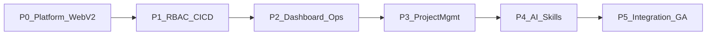
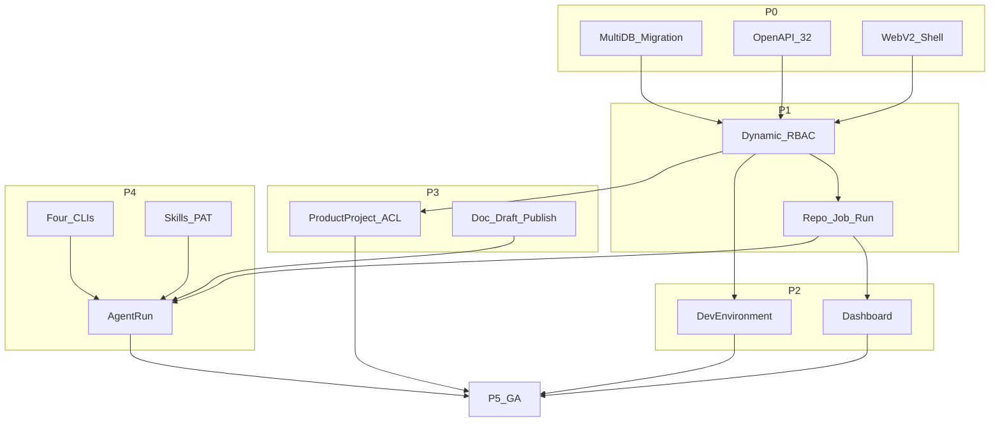

# Bedrock 2.0 开发路线图

| 项 | 内容 |
| --- | --- |
| 文档版本 | 2.0.0 |
| 状态 | 已确认基线 |
| 输入 | [PRD.md](./PRD.md)、[DESIGN.md](./DESIGN.md)、PRD 审查 canvas、`refactor.md` |
| 范围 | 分阶段完成全量 2.0 GA；**不提供日历工期**，仅定义依赖、交付物与退出 Gate |

---

## 0. 决策摘要（本路线图约束）

完整决策与技术契约见 [DESIGN.md](./DESIGN.md) §1。本文件仅复述影响分期的硬约束：

1. **交付方式**：分阶段完成七大域后发布 2.0 GA；阶段顺序固定为 P0→P1→P2→P3→P4→P5。
2. **升级**：2.0 **只支持全新安装**，不迁移 1.x 数据。
3. **前端**：旁路新建 `web/`（Vue 3 + Veltra + CatKit + Vite+）；达标后一次切换 embed，旧 `web/` 保留回滚窗口。
4. **安全边界（已接受风险）**：允许 HTTP；`access_token` Web Storage + Bearer，`refresh_token` HttpOnly Cookie（不设 Secure）；构建/AI CLI **同 Bedrock UID** 直接执行。
5. **CI/CD 状态**：归档成功后 BuildRun 保持 `success`；`distribution_summary` 反映最新分发；重新分发**追加** `BuildDeployAttempt`，不新建 BuildRun。
6. **ACL**：仅**产品项目**使用对象级成员 ACL；资源管理 / CI/CD / AI 等依赖全局 RBAC；显式 `view_all` / `manage_all` 绕过成员范围。
7. **验收**：仅功能 Gate；不设容量与延迟 SLO。

---

## 1. 里程碑总览

| 阶段 | 名称 | 目标 | 前置 | 不做项（本阶段） |
| --- | --- | --- | --- | --- |
| **P0** | 平台底座 + web-v2 骨架 | 多库、migration、OpenAPI 契约、空壳前端可登录 | 无 | 业务域 CRUD、CI/CD 重构、运维/项目/AI |
| **P1** | RBAC + CI/CD 重构 | 动态权限、菜单下发、仓库/任务/执行/部署闭环 | P0 | 项目管理、AI/Skills、开发环境安装、可配置仪表盘卡片 |
| **P2** | 仪表盘 + 运维 | 三卡片布局、进程、开发环境与每环境安装源 | P1 | 产品项目、Agent、Skills |
| **P3** | 项目管理 | 产品项目、成员 ACL、需求、文档树与草稿发布 | P2 | AI CLI 四件套、Skill 安装器（文档生成可先 stub 或依赖 P4 并行接入点） |
| **P4** | AI + Skills | 四 CLI 并行、智能体、触发器、AgentRun、Skill/PAT | P1（可与 P3 部分并行，GA 依赖两者） | 非功能容量调优、多节点调度 |
| **P5** | 全域集成与 2.0 GA | 端到端回归、embed 切换、文档与发布包 | P0–P4 全部 Gate | 1.x 数据迁移、远程 Runner、对象存储 |

> **并行说明**：P3 与 P4 在后端领域上可部分并行开发，但 **P5 / GA 要求两者 Gate 均通过**。P4 的「构建事件触发 Agent」依赖 P1 的 BuildRun 事件；P3 的「智能体生成文档」依赖 P4 的 AgentRun（P3 可先完成草稿/发布模型，生成入口在 P4 接通）。

---

## 2. P0 — 平台底座 + web-v2 骨架

### 2.1 目标

建立 2.0 可开发的技术地基：配置驱动多数据库、版本化 schema、OpenAPI 契约流水线、统一存储/任务抽象骨架，以及可登录的 Vue 3 空壳。

### 2.2 交付物

| 类别 | 内容 |
| --- | --- |
| 后端 | `internal/platform`（config、db 工厂、连通性检查）；`schema_migrations` + 版本化 Go migration 注册表；User/超管种子；JWT login/refresh/me（权限与菜单可先空树）；StorageService 骨架；长任务队列接口骨架 |
| API | `openapi/openapi.yaml`（3.2 源）+ 自动生成 `openapi/openapi.3.1.projection.yaml`（禁止手改）；合同测试脚手架 |
| 前端 | `web/`：Vite+、`@veltra/*`、`@cat-kit/*`、Pinia auth、Vue Router 守卫、登录页（`password_cipher`）、AppLayout 空壳 |
| 构建 | Makefile：`FRONTEND_DIR` 可切换；`make dev` 支持 web-v2；Linux amd64/arm64 交叉编译目标声明 |
| 测试 | 三驱动启动连通性；migration 幂等；登录加密字节兼容 golden test |

### 2.3 明确不做

- 动态 RBAC 资源树完整 CRUD、CI/CD 实体拆分、运维开发环境、产品项目、AI
- 将 `web` 设为默认 embed 源
- 容量/延迟压测

### 2.4 退出 Gate

1. `driver=sqlite|postgres|mysql` 均可启动；错误配置拒绝启动且错误可读。
2. 版本化 migration 可重复执行；`schema_migrations` 记录版本。
3. OpenAPI 3.2 源校验通过；3.1 投影由 CI 生成且与源 diff 策略明确。
4. `web-v2` 可登录、refresh、登出；HTTP 非安全上下文与安全上下文均可提交 `password_cipher`。
5. 文档声明：切换 driver **不搬迁数据**；2.0 全新安装。

### 2.5 风险

- OpenAPI 3.2 契约不完整 → 依赖投影，禁止手改投影。
- Makefile / AGENTS 与现网命令漂移 → P0 同步修正目标态命令。

---

## 3. P1 — RBAC + CI/CD 重构

### 3.1 目标

用可配置 RBAC 替换固定三角色；将 1.x `Project/Environment/Build` 演进为 `Repository / BuildJob / BuildRun`；完成构建—归档—分发主路径。

### 3.2 交付物

| 类别 | 内容 |
| --- | --- |
| 权限 | Role、RolePermission、MenuGroup、RbacResource；多角色并集；`RequirePermission(full_code)`；登录/me 下发两层分组菜单；菜单图标 Base64 ≤32KB；`super_admin_only` 门控运维 |
| 资源管理 | Repository、Server、Credential；绑定/修改凭证引用时校验 `resource_credentials:use` |
| CI/CD | BuildJob、DeployTarget（Job 私有 1:N）、BuildRun、BuildDeployAttempt；Pipeline 适配；Scheduler/Cron（IANA 时区、禁重叠、停机跳过）；Webhook（签名优先 + URL secret fallback + delivery 去重）；执行侧仅需任务 `execute` |
| 状态机 | `status` 与 `stage` 分离；归档成功 → `status=success`；分发更新 `distribution_summary`；redeploy 追加 attempt；Run 最小配置快照；queued 恢复 / running→interrupted |
| 前端 | 菜单驱动侧栏；资源管理（仓库/服务器/凭证）与 CI/CD（任务/执行）页面；构建日志 WS；重新分发 UI |
| 测试 | 权限矩阵；Webhook 多平台；分发失败不改构建成功；重启恢复；三库 CRUD 合同测试 |

### 3.3 明确不做

- 产品项目成员 ACL、需求/文档
- AgentRun、Skill、PAT、四 CLI
- 可配置仪表盘布局（可保留只读摘要 API stub）
- 自定义开发环境命令脚本

### 3.4 退出 Gate

1. 自定义角色勾选功能 `full_code` 后，菜单/路由/API 一致生效；`super_admin_only` 对非超管恒 403。
2. 同一仓库 ≥2 个 BuildJob 可分别执行；制品可下载。
3. 部署失败时 BuildRun 仍为 `success`，summary 为 `partial` / `all_failed`；redeploy 追加 `BuildDeployAttempt` 且 summary 更新为最新结果。
4. Webhook：平台签名校验优先；generic/手动仍可用 URL secret；日志脱敏。
5. Cron：每任务 IANA 时区；同任务禁止重叠；停机错过的触发跳过。
6. 服务重启：queued 重新入队；running → interrupted，可人工 retry。

### 3.5 风险

- 旧引擎与 Project/Environment 耦合深 → 通过接口适配层迁到新模型，避免双写。
- 同 UID 脚本执行 → 限制脚本编辑权限并审计；风险写入用户可见说明。

---

## 4. P2 — 仪表盘 + 运维

### 4.1 目标

可配置仪表盘三卡片；超管运维：进程管理 + 开发环境（含每环境多安装源）。

### 4.2 交付物

| 类别 | 内容 |
| --- | --- |
| 仪表盘 | DashboardLayout；构建摘要 / 系统信息 / 系统状态卡片；按资源权限过滤；用户排序与显隐持久化 |
| 系统信息 | 非超管可见**完整只读**系统信息（与超管信息字段一致），但无运维写操作 |
| 运维 | 进程列表/终止（保护自身与危险进程）；DevEnvironment；每环境 InstallSource 优先级回退；DevEnvJob（同重启协议） |
| 自定义开发环境 | **仅超管**可创建/修改/执行；脚本快照 + 强提示 + 完整审计 |
| 前端 | 仪表盘编辑；运维进程页；开发环境卡片（含安装源与任务） |
| 测试 | 无权限卡片不可见；非超管运维 API 403；源回退可观测 |

### 4.3 明确不做

- 自定义仪表盘任意组件市场
- 全文日志检索、操作日志导出（查询即可）
- AI / 项目管理

### 4.4 退出 Gate

1. 无 `cicd_build_runs:view` 的角色看不到构建卡片且无法添加。
2. 布局刷新后保持；状态卡片按合理频率刷新且不阻塞首屏。
3. 超管可检测/安装/升级/卸载/切版本；第一源失败第二源成功时可追踪。
4. 非超管调用运维 API 恒 403；自定义命令非超管不可维护。

---

## 5. P3 — 项目管理

### 5.1 目标

独立产品协作域：产品项目、成员角色、需求列表、Markdown 接口文档树；与 CI/CD 松耦合可选关联。

### 5.2 交付物

| 类别 | 内容 |
| --- | --- |
| 项目 | ProductProject、ProjectMember（Owner/Admin/Member/Readonly）；显式 `project_projects:view_all` / `manage_all` |
| 需求 | Requirement、评论、附件（走 StorageObject）；状态字典可扩展 |
| 文档 | ApiDocNode 树；同节点 `published_content` + `draft_content` + `base_version`；上传/移动/删除；发布 `expected_version` 乐观锁 |
| 权限 | 全局 RBAC **且** 项目成员 ACL（无 view_all/manage_all 时）；manage_all 可管理全部项目且无需加入 |
| 前端 | 项目列表/详情、成员、需求、文档树、草稿 diff 与发布确认 |
| 测试 | 非成员不可见；view_all/manage_all 行为；并发发布 409；附件配额与 XSS 防护 |

### 5.3 明确不做

- 可配置任意需求状态机（首期固定 + 字典扩展）
- 强制绑定 CI/CD 仓库
- Skill 市场器（属 P4）

### 5.4 与 P4 的接口

- `POST .../docs/generate` 可在本阶段定义契约，实现可返回「依赖 AI 域」或在 P4 接通后启用。
- 草稿/发布模型**本阶段必须完成**，不依赖 Agent。

### 5.5 退出 Gate

1. 成员角色能力符合 PRD；普通用户仅见加入的项目。
2. `view_all` 可见全部；`manage_all` 可管理成员与内容且无需加入项目；普通 `:update` **不**隐含全局越权。
3. 多级文档树、上传 `.md`/压缩包导入可用。
4. 生成结果只写 draft；发布需确认；`expected_version` 冲突返回 409；可查看 diff 摘要。

---

## 6. P4 — AI + Skills

### 6.1 目标

四类 AI CLI **并行**交付；智能体定义/触发/运行；开放 Agent Skills；PAT 下载。

### 6.2 交付物

| 类别 | 内容 |
| --- | --- |
| CLI | Claude Code、OpenCode、Reasonix、Codex：检测/安装/升级/卸载、多源回退、运行时注入配置（运行时管理归属资源管理域：`/resource/clis`、`resource_clis:*`） |
| 智能体 | AiAgent、AgentTrigger（手动/API/定时/构建事件）；AgentRun 独立异步；上下文 = 提示词 + 仓库 |
| 构建事件 | 默认 `artifact_ready`（归档成功、制品可用）；BuildJob 可覆盖为 `distribution_finished` |
| Skills | ZIP 上传、SKILL.md 校验、public/private、覆盖更新、工作区注入 |
| PAT | 哈希存储、仅显示一次、可过期/吊销；固定 scope：`skills:read`、`agents:run`（管理接口归属资源管理域：`/resource/tokens`、`resource_tokens:*`） |
| 文档生成 | 接通 P3：`docs/generate` → AgentRun → 只写 draft |
| 前端 | CLI 管理与 PAT 管理（资源管理菜单）、智能体、触发器、运行日志 WS、Skills |
| 测试 | 四 CLI 安装与非交互运行；构建事件不改 BuildRun 成功态；PAT 鉴权；私有 Skill 隔离 |

### 6.3 明确不做

- 自动注入需求/文档/历史会话为上下文
- 远程 Runner / OS 沙箱隔离
- Skill 版本历史（覆盖更新）

### 6.4 退出 Gate

1. 四种 CLI 均可完成检测与至少一条参考运行路径（健康或可观测失败）。
2. 手动/API/Cron/构建事件均可创建独立 AgentRun；失败不影响已成功 BuildRun。
3. 合法 Skill ZIP 可上传；缺 SKILL.md 拒绝；更新后下载为新包。
4. PAT：无效 401；scope 外端点 403；私钥仅创建时回显一次。
5. 文档生成写入 draft，需人工发布。

---

## 7. P5 — 全域集成与 2.0 GA

### 7.1 目标

跨域端到端验收、前端正式切入 embed、发布物与文档齐套，宣布 2.0 GA。

### 7.2 交付物

| 类别 | 内容 |
| --- | --- |
| 前端切换 | 通过 web 切换 Gate 后，默认 `FRONTEND_DIR=web`；CI/Release 拷贝 `web/dist` → `cmd/server/dist` |
| 集成测试 | 登录→RBAC 菜单→构建→分发→通知→（可选）Agent→文档草稿发布；三数据库矩阵；Linux amd64/arm64 冒烟 |
| 文档 | PRD / DESIGN / ROADMAP / AGENTS 一致；操作手册与风险说明（HTTP、同 UID） |
| 发布 | 单二进制 Server + 独立 Deploy Agent；默认 SQLite 全新安装路径 |

### 7.3 web-v2 切换 Gate（必须全部满足）

1. 路由深链与书签路径可用（含构建详情等）。
2. API 信封、401 refresh、登出跳转与旧行为一致。
3. `password_cipher` 字节级兼容；`__BEDROCK_ENCRYPTION_KEY__` 注入有效。
4. WS：构建日志与通知；Agent 日志（若已启用）。
5. 制品下载、备份/恢复或等价 FormData 上传下载可用。
6. 菜单完全由服务端下发，无本地硬编码全量菜单。
7. `bun run lint && bun run build`（或 `vp check && vp build`）零错误；`go build` embed 成功。

### 7.4 明确不做（整个 2.0 GA）

- 1.x → 2.0 自动/离线数据迁移
- 多活水平扩展、远程构建 Runner、S3 对象存储
- 容量/延迟 SLO 验收
- 显式 deny 权限、非项目域对象 ACL

### 7.5 退出 Gate（2.0 GA）

1. P0–P4 各 Gate 全部通过且无未关闭的落地阻塞项。
2. web 为默认嵌入前端；回滚说明已文档化。
3. 模块验收清单（PRD §20 语义，按 DESIGN 固化后的行为）全部勾选。
4. 已知风险（HTTP、同 UID、自定义超管命令）在产品内可见且写入 AGENTS/DESIGN。

---

## 8. 跨阶段依赖与关键路径

**关键路径（无工期）**：P0 数据库/契约 → P1 RBAC+CI/CD 状态机 → P4 Agent 事件集成 → P5 GA。仪表盘/运维/项目管理可在 P1 之后并行推进，但不缩短上述关键路径。

---

## 9. 每阶段通用质量门禁

进入下一阶段前，除阶段 Gate 外还需：

1. 新增/变更 API 已写入 OpenAPI 3.2 源，投影已再生。
2. 涉及表结构变更已增加版本化 migration，三驱动合同测试通过。
3. 写操作有审计；敏感字段不落日志。
4. 前端变更遵守 Veltra / CatKit / Vue 最佳实践技能约束。
5. 不引入「1.x 自动迁移」「部署失败改构建失败」「流水线内同步 Agent」等已否决设计。

---

## 10. 文档维护

| 变更类型 | 需更新 |
| --- | --- |
| 分期顺序或 Gate | 本文件 + DESIGN §1 决策表 |
| 表结构 / 状态机 / API | DESIGN + OpenAPI |
| 日常开发约定 | AGENTS.md（入口）+ `.agents/fe.md` / `.agents/be.md` |
| 产品需求语义 | PRD.md（重大变更需同步回填本路线图决策摘要） |

**文档结束。**
